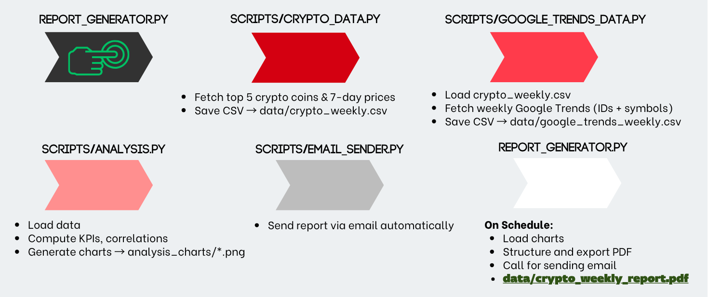

# Python automated weekly reporting pipeline

## Overview
This project is a fully automated weekly reporting system for tracking the top five cryptocurrencies by market capitalization. It fetches price data, Google Trends interest, computes KPIs, generates visualizations, and produces a structured PDF report, which is automatically sent via email every Wednesday at 3 PM.

## Data Source
**CoinGecko API**  [(CoinGecko Website)]( https://www.coingecko.com/)  
Fetch the top 5 cryptocurrencies by market capitalization and retrieve hourly historical prices for the past 7 days.  

**Google Trends - PyTrends Library**  (Unofficial Google Trends API)  
Access search interest for each top 5 coin using both coin names and symbols to improve trend accuracy.

## Workflow Diagram 

### 1. Fetch Top 5 Cryptocurrencies
- The project retrieves the top 5 cryptocurrencies by market capitalization using the CoinGecko API.
- For each coin, it collects 7-day historical price data at hourly intervals.
- The data is stored as: **[data/crypto_weekly.csv](data/crypto_weekly.csv)**

#### Code: [scripts/crypto_data.py](scripts/crypto_data.py)

### 2. Fetch Google Trends Data
- The script loads crypto_weekly.csv to get the coin IDs and symbols.
- Using the PyTrends library, it fetches weekly Google Trends data for each coin, considering both their IDs and symbols to improve accuracy.
- The trends data is saved as: **[data/google_trends_weekly.csv](data/google_trends_weekly.csv)**

#### Code: [scripts/google_trends_data.py](scripts/google_trends_data.py)

### 3. Data Analysis & KPIs
- Load the crypto and trends CSVs.
- Compute KPIs for each coin and saves as: **[data/crypto_weekly_kpis.csv](data/crypto_weekly_kpis.csv)**
  - Weekly return (%)
  - Volatility (standard deviation of price)
  - Maximum & minimum prices
  - Average trend interest
  - Correlation between price and Google Trends
- Align data timestamps and merges price and trends data for analysis.

- Generate Visual Insights:
  - Crypto Prices Subplots (one subplot per coin)
  - Google Trends Line Chart
  - Weekly Return Bar Chart
  - Volatility Strip Plot
  - Correlation Heatmap
  - KPI Table Visual

#### Code: [scripts/analysis.py](scripts/analysis.py)

### 4. Automated Email Delivery
- Create dedicated module for sending email 

#### Code: [scripts/email_sender.py](scripts/email_sender.py)

### 5. Generate & Send Report
- Build PDF Report:
  - Adjust structure of pdf for better readability.
  - Combine KPI summaries table and charts as a pdf report: **[data/Crypto_Weekly_Report.pdf](data/Crypto_Weekly_Report.pdf)**

- Call email_sender.py to send the PDF via email.
- Send report automatically every Wednesday at 15:00.  
- The pipeline ensures automation: data fetching → analysis → reporting → delivery.

#### Code: [report_generator.py](report_generator.py)
##
**Notes**
- Both API have request limits; inserted time.sleep function to prevent request errors.
- PNG files are saved in: **[analysis_charts/](analysis_charts/)**

## Technical details
- **Tools:** Python, VsCode
- **Data Sources:** CoinGecko API, Google Trends (PyTrends)
- **Libraries:** Pandas, NumPy, Matplotlib, Seaborn, ReportLab, Schedule, smtplib